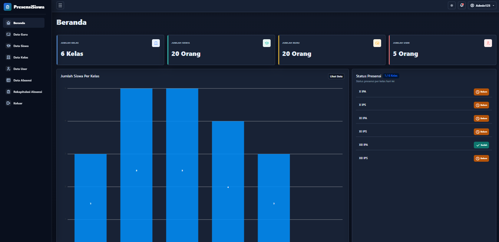
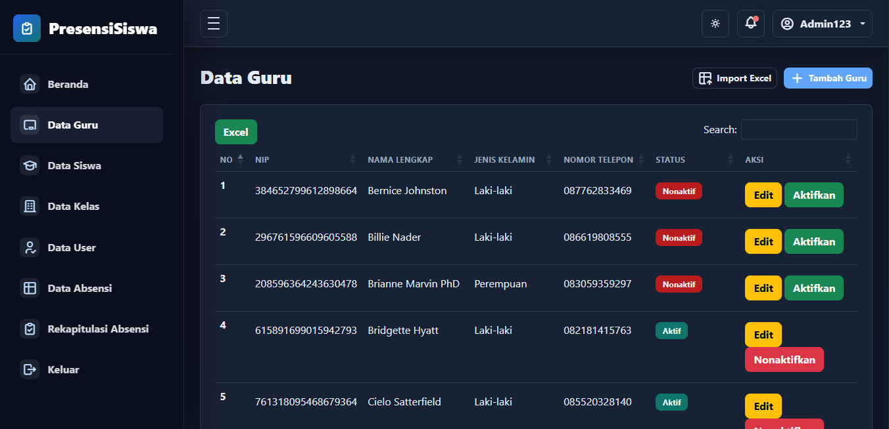
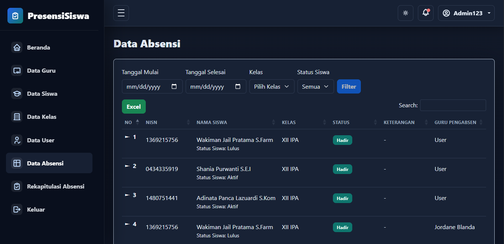
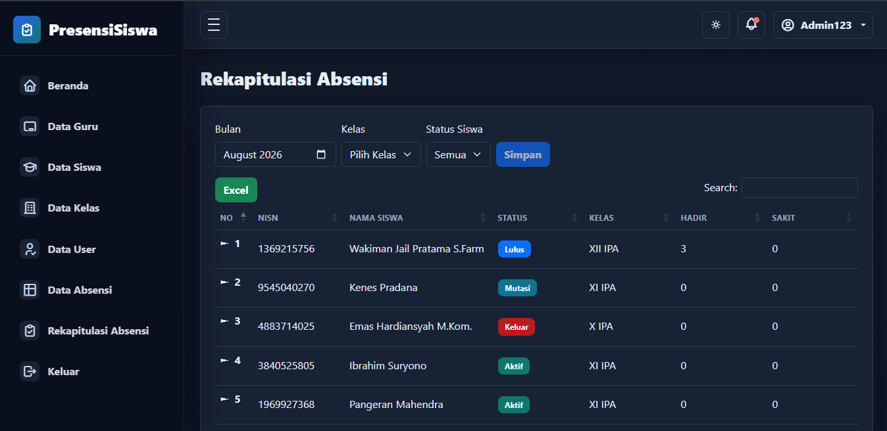

<div align="center">

# 📚 PresensiSiswa

A Laravel-based school attendance management system with role-based access, class-based attendance sessions, QR-based class access, bulk data validation, attendance recaps, and Excel reporting.

[](https://laravel.com)
[](https://php.net)
[](https://getbootstrap.com)
[](https://mysql.com)

</div>

---

## 📌 Project Overview

Student Attendance Management System is a Laravel-based web application designed to manage student attendance in a school environment.

The system provides role-based workflows for Admin, Teacher (Guru), and Counselor (BK), covering master data management, class-based attendance sessions, attendance recaps, Excel import/export, and attendance monitoring.

The attendance workflow is designed around the assigned class and attendance date, helping ensure that teachers only record attendance for authorized classes while preserving historical attendance records.

---

## ✨ Key Features

- **Role-Based Access Control**
    - Separate access and workflows for Admin, Teacher, and Counselor (BK).
    - Role-specific restrictions are enforced at the application level.

- **Class-Based Attendance Sessions**
    - Teachers can only record attendance for authorized classes.
    - Classes can be accessed through QR Code or selected from the teacher's authorized class list.
    - Attendance records are associated with a specific class and attendance date.
    - Attendance records can only be edited on the same day.

- **Attendance Recaps & Filtering**
    - Monthly attendance recap for Admin, Teachers, and BK.
    - Filter attendance data by month, class, and student status.
    - View attendance records based on the selected criteria.

- **Bulk Excel Import**
    - Import teacher and student data using Excel files.
    - Row-level validation provides feedback for invalid data.
    - Excel templates include formatting requirements to reduce input errors.

- **Status-Based Data Management**
    - Teacher and user accounts can be marked as Active or Inactive.
    - Students can be assigned statuses such as Active, Graduated (Lulus), Transferred (Mutasi), or Dropped Out (Keluar/DO).
    - Delete actions are restricted to help preserve historical attendance data.

- **Dynamic User Creation**
    - Admins can select an existing teacher when creating a Teacher user account.
    - Teacher information such as name and username can be populated automatically.
    - Random passwords can be generated during user creation.

- **Attendance Reporting**
    - Filter attendance data according to selected criteria.
    - Export attendance data to Excel.

- **Role-Specific Dashboards**
    - Admin dashboard displays student distribution by class and today's attendance completion status.
    - BK dashboard provides student distribution by class along with current-date information.

---

## 👥 User Roles

| Role                  | Responsibilities                                                                                                       |
| :-------------------- | :--------------------------------------------------------------------------------------------------------------------- |
| **🛡️ Admin**          | Manage users, teachers, students, classes, attendance data, and reports.                                               |
| **👨‍🏫 Teacher (Guru)** | Access authorized class sessions, record and update daily student attendance, view recaps, and export attendance data. |
| **🧑‍💼 Counselor (BK)** | Monitor attendance records, view student attendance recaps, filter attendance data, and review attendance statistics.  |

---

## 🎬 Core Workflows

The following demonstrations highlight the main workflows and business rules implemented in the application.

### 1. Class-Based Attendance Workflow

> Teachers access an authorized class through QR Code or the available class list, record student attendance, and manage the attendance session according to the attendance date.

<video src="docs/demos/01-attendance-session.mp4" controls autoplay loop muted width="100%"></video>

---

### 2. Excel Import & Row-Level Validation

> Teacher and student data can be imported in bulk through Excel files. Invalid rows are detected and reported through validation feedback.

<video src="docs/demos/02-excel-import-validation.mp4" controls autoplay loop muted width="100%"></video>

---

## 🖥️ Application Overview

The Admin dashboard provides an overview of school data and today's attendance activity, including student distribution by class and attendance completion status.

<p align="center">
  
</p>

### Master Data Interface

The application uses a consistent management interface across its master data modules, including teachers, students, classes, and users.

<p align="center">
  
</p>

<p align="center">
  <i>Example of the teacher management interface.</i>
</p>

### Attendance Recap

Attendance recaps provide a structured view of student attendance records with filtering options for month, class, and student status.

<p align="center">
  
  
</p>

<p align="center">
  <i>Example of the attendance recap and filtering interface.</i>
</p>

---

## 🛠️ Tech Stack

- **PHP 8.1**
- **Laravel 10**
- **Bootstrap 5**
- **MySQL**
- **AdminHMD Bootstrap Admin Template**

---

## 📦 Packages

| Package                                                   | Purpose                     | Status  |
| :-------------------------------------------------------- | :-------------------------- | :------ |
| [PHP Flasher](https://github.com/php-flasher/php-flasher) | Flash message notifications | Used ✅ |
| [Laravel Excel](https://laravel-excel.com/)               | Excel import and export     | Used ✅ |

---

## ⚡ Quick Install

### Prerequisites

- PHP 8.1 or higher
- Composer
- MySQL

### Installation

1. **Clone the repository**

    ```bash
    git clone https://github.com/andraadev/PresensiSiswa.git
    cd PresensiSiswa
    ```

2. **Install PHP dependencies**

    ```bash
    composer install
    ```

3. **Configure the environment**

    ```bash
    cp .env.example .env
    php artisan key:generate
    ```

    Configure the database credentials in the `.env` file.

4. **Run migrations and seed the database**

    ```bash
    php artisan migrate --seed
    ```

5. **Create the public storage link**

    ```bash
    php artisan storage:link
    ```

6. **Start the development server**

    ```bash
    php artisan serve
    ```

7. Open the application at:

    `http://127.0.0.1:8000`

---

## 🔐 Default Login

> Default accounts are intended for development and testing purposes only.

- **Admin**
    - Username and Password: `Admin123`
- **Teacher**
    - Username and Password: `User123`
- **BK**
    - Username and Password: `User678`

> These values match the seeded defaults created in the application seeder.

---

## 📌 Project Status

> **Maintained, but development is limited**

This project was initially developed as part of an academic assessment.

The application has reached a usable state for its intended scope and is maintained for critical bug fixes, security improvements, and necessary adjustments. Future feature development is not guaranteed and may depend on project needs.

The project is primarily provided for educational, reference, and portfolio purposes and is **not recommended for production use without further security review, testing, and environment-specific configuration**.

---

## 📝 What's New

For version history and detailed changes, see the [CHANGELOG.md](CHANGELOG.md).

---

## ⚠️ Disclaimer

This software is provided "as is", without warranty of any kind, express or implied.

The user assumes all responsibility and risk for the use of the software. No official support or maintenance is provided.
